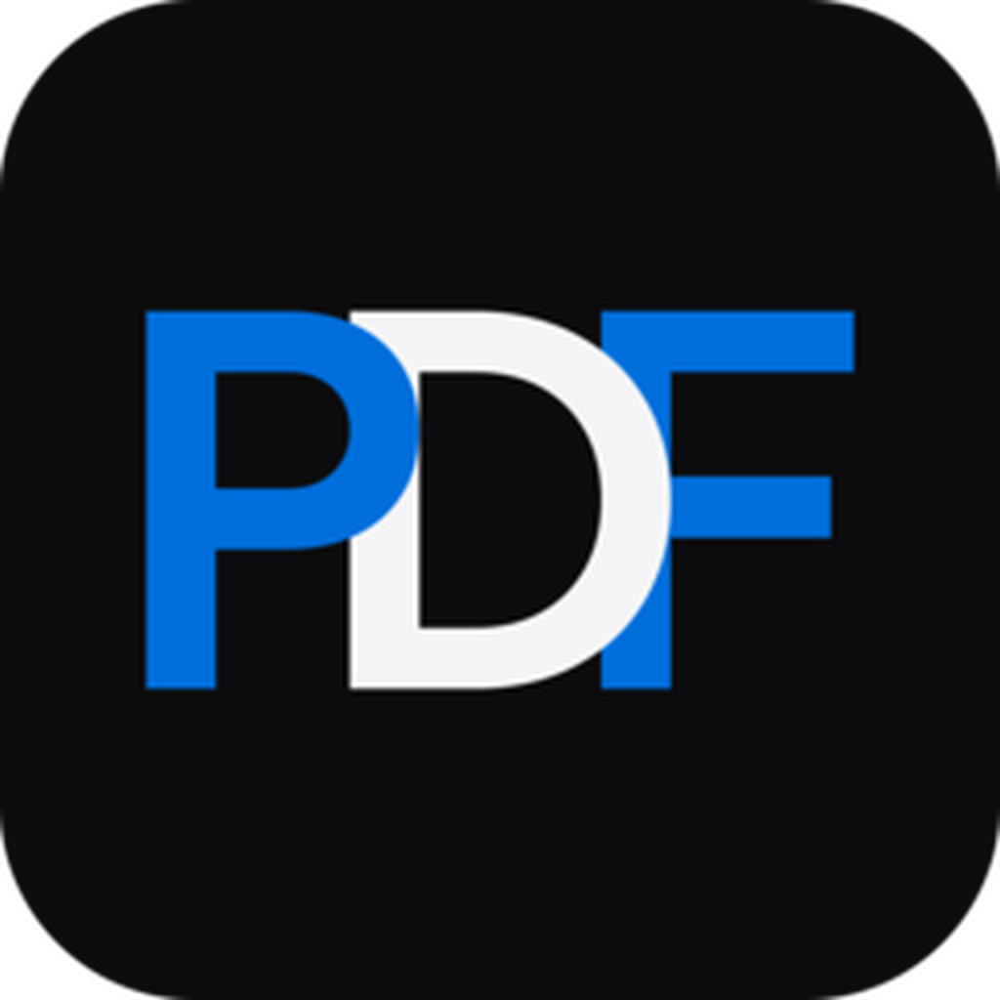

<div align="center">
  

# _davPDF

**Gestisci PDF localmente, senza upload e senza account.**  
**Manage PDFs locally, with no uploads and no accounts.**

Windows · macOS · Linux · Local-first · Open source

[](#-italiano)
[](#-english)

</div>

---

# 🇮🇹 Italiano

_davPDF è una toolbox desktop multipiattaforma di **_davstudios** pensata per eseguire le operazioni PDF più comuni direttamente sul computer.

La `v1.0.0` include un motore locale per unire, dividere, riorganizzare, ruotare, comprimere, modificare metadata, proteggere e sbloccare PDF, oltre a conversioni PDF ↔ immagini e miniature reali delle pagine.

<p>
  <a href="https://www.davstudios.it"></a>
  <a href="https://buymeacoffee.com/davstudios"></a>
</p>

## Perché _davPDF

Molti strumenti PDF richiedono di caricare documenti online. _davPDF nasce con una filosofia diversa: **il documento resta sul dispositivo** e ogni operazione produce una nuova copia senza sovrascrivere automaticamente l'originale.

### Funzioni principali

- Merge di più PDF con ordine configurabile;
- Split ogni pagina, ogni N pagine o tramite intervalli personalizzati;
- Page Manager con miniature reali per riordinare, ruotare e rimuovere pagine;
- compressione strutturale con preset responsabili;
- lettura e modifica dei metadata standard;
- rimozione metadata;
- protezione PDF con password;
- Unlock soltanto con password corretta;
- PDF → PNG, JPG e WebP a 72, 150, 300 o 600 DPI;
- Images → PDF con A4, A3, Letter o dimensione immagine, margini, Fit e Fill;
- drag & drop di PDF;
- cronologia locale delle operazioni;
- interfaccia in italiano e inglese;
- tema Sistema, Chiaro e Scuro.

<details>
<summary><strong>Sicurezza dei documenti</strong></summary>

Le operazioni vengono eseguite su nuove copie. Prima del file finale viene scritto un file temporaneo; soltanto dopo un salvataggio riuscito viene spostato nella destinazione scelta.

Se un nome output esiste già, il backend genera un nome alternativo invece di sovrascriverlo automaticamente.

</details>

<details>
<summary><strong>Privacy e filosofia locale</strong></summary>

- nessun account;
- nessun upload dei PDF;
- nessuna elaborazione cloud;
- nessuna telemetria integrata;
- nessuna pubblicità.

I documenti restano sul dispositivo.

</details>

## Compressione

_davPDF non mostra percentuali di riduzione inventate prima dell'elaborazione. Un PDF già ottimizzato può ridursi poco o restare di dimensioni simili; il risultato effettivo viene mostrato soltanto dopo la creazione del nuovo file.

## Crittografia

La funzione **Protect PDF** crea una nuova copia protetta da password. **Unlock PDF** funziona soltanto quando conosci la password corretta e non include strumenti per aggirare password sconosciute.

## Conversioni e rendering

`PDF → PNG/JPG/WebP`, `Images → PDF` e le miniature del Page Manager sono incluse nella `v1.0.0`. Il rendering delle pagine usa **PDFium** in locale; il runtime viene scaricato automaticamente dagli script di sviluppo/build e incluso nei pacchetti finali, quindi l’utente non deve installarlo separatamente.

## Piattaforme

| Sistema | Architettura | Pacchetto previsto |
| --- | --- | --- |
| Windows 10/11 | x64 | NSIS `.exe` |
| macOS | Intel + Apple Silicon | Universal `.dmg` |
| Linux | x64 | `.AppImage` / `.deb` |

Le build di release vengono generate tramite GitHub Actions sui rispettivi sistemi operativi.

## Installazione delle release GitHub non firmate

Le release di `_davPDF` sono distribuite direttamente tramite GitHub e, al momento, non utilizzano certificati commerciali di code signing o notarizzazione Apple. Il codice sorgente è disponibile pubblicamente con licenza MIT.

### Windows

Windows SmartScreen può mostrare l'avviso **“Windows ha protetto il PC”** perché l'installer non è firmato con un certificato di publisher attendibile. Se hai scaricato il file dalla repository GitHub ufficiale di `_davstudios`, seleziona **Ulteriori informazioni** e poi **Esegui comunque**.

### macOS

Gatekeeper può impedire la prima apertura perché l'app non è firmata con Developer ID e non è notarizzata da Apple. Dopo aver tentato di aprire l'app, vai in **Impostazioni di Sistema → Privacy e Sicurezza**, individua il messaggio relativo a `_davPDF` e scegli **Apri comunque**.

### Linux

Per un'AppImage può essere necessario rendere il file eseguibile prima dell'avvio:

```bash
chmod +x _davPDF*.AppImage
```

Scarica sempre le release dalla repository GitHub ufficiale di `_davstudios`. Quando viene pubblicato un hash SHA-256, puoi usarlo per verificare l'integrità del file scaricato.

## Informazioni pacchetto

- Developer / Publisher: `_davstudios`
- Homepage: https://davstudios.it
- Licenza: MIT
- Bundle identifier: `studio.dav.pdf`
- Versione corrente: `26.10.3`

## Sviluppo locale

Requisiti: Node.js, Rust 1.88 o superiore e i prerequisiti Tauri del sistema operativo. Gli script `RUN-*` e `BUILD-*` preparano automaticamente il runtime PDFium corretto per la piattaforma.

```bash
npm install
npm run desktop
```

La modalità sviluppo usa la porta locale dedicata `17333` e ripulisce automaticamente eventuali sessioni `_davPDF` rimaste aperte su Windows.

Test:

```bash
npm test
```

Build locale:

```bash
npm run bundle
```

Gli artefatti vengono creati in `src-tauri/target/release/bundle/`.

## Tecnologia

_davPDF usa **Tauri 2** per l'app desktop, **Rust + lopdf** per la manipolazione PDF, **PDFium** per il rendering, **printpdf** per la creazione di PDF da immagini e **JavaScript + Vite** per l'interfaccia. Il design e il motion system seguono la stessa identità visiva di `_davRENAME`, `_davIMAGE` e `_davDUPLICATE`.

## Note della release

La v26.10.3 corregge il contratto di verifica del runtime PDFium nella pipeline multipiattaforma: i test non richiedono più una DLL Windows generata nel repository, mentre GitHub Actions controlla dopo la preparazione la libreria corretta per Windows, macOS o Linux. Restano attivi i controlli di percorso e sincronizzazione versione compatibili con checkout Windows CRLF, senza modifiche al motore PDF, al rendering PDFium, all'interfaccia o alla logica funzionale dell'app. La v1.0.0 rimane la prima release stabile di `_davPDF`.

## Licenza

Distribuito con licenza **MIT**. Consulta [`LICENSE`](LICENSE).

### Supporta _davstudios

Se `_davPDF` ti è utile e vuoi sostenere lo sviluppo dei prossimi strumenti della suite, puoi offrirmi un caffè.

<p>
  <a href="https://buymeacoffee.com/davstudios"></a>
  <a href="https://www.davstudios.it"></a>
</p>

<div align="right"><a href="#davpdf">↑ Torna all'inizio</a></div>

---

# 🇬🇧 English

_davPDF is a cross-platform desktop PDF toolbox by **_davstudios**, designed to perform common PDF operations directly on your computer.

The `v1.0.0` release includes a local engine for merging, splitting, reorganizing, rotating, compressing, editing metadata, protecting, and unlocking PDFs, plus PDF ↔ image conversion and real page thumbnails.

<p>
  <a href="https://www.davstudios.it/en"></a>
  <a href="https://buymeacoffee.com/davstudios"></a>
</p>

## Why _davPDF

Many PDF tools require documents to be uploaded online. _davPDF follows a different approach: **the document stays on your device**, and each operation creates a new copy without automatically overwriting the original.

### Main features

- merge multiple PDFs in a configurable order;
- split every page, every N pages, or custom ranges;
- Page Manager with real thumbnails for reordering, rotating, and removing pages;
- structural PDF compression with responsible presets;
- standard metadata inspection and editing;
- metadata removal;
- PDF password protection;
- Unlock only with the correct password;
- PDF → PNG, JPG, and WebP at 72, 150, 300, or 600 DPI;
- Images → PDF with A4, A3, Letter, or image-sized pages, margins, Fit, and Fill;
- PDF drag & drop;
- local activity history;
- Italian and English interface;
- System, Light, and Dark themes.

<details>
<summary><strong>Document safety</strong></summary>

Operations are written to new copies. A temporary file is created first; only after a successful save is it moved to the selected destination.

If an output filename already exists, the backend generates an alternative name instead of automatically overwriting it.

</details>

<details>
<summary><strong>Privacy and local-first approach</strong></summary>

- no account;
- no PDF uploads;
- no cloud processing;
- no built-in telemetry;
- no ads.

Documents stay on your device.

</details>

## Compression

_davPDF does not show invented reduction percentages before processing. A PDF that is already optimized may shrink only slightly or remain similar in size; the actual result is shown only after the new file has been created.

## Encryption

**Protect PDF** creates a new password-protected copy. **Unlock PDF** only works when you know the correct password and includes no tools for bypassing unknown passwords.

## Conversion and rendering

`PDF → PNG/JPG/WebP`, `Images → PDF`, and Page Manager thumbnails are included in `v1.0.0`. Page rendering uses **PDFium** locally; the correct runtime is downloaded automatically by the development/build scripts and bundled into final packages, so end users do not install it separately.

## Platforms

| System | Architecture | Planned package |
| --- | --- | --- |
| Windows 10/11 | x64 | NSIS `.exe` |
| macOS | Intel + Apple Silicon | Universal `.dmg` |
| Linux | x64 | `.AppImage` / `.deb` |

Release builds are generated through GitHub Actions on the corresponding operating systems.

## Installing unsigned GitHub releases

`_davPDF` releases are distributed directly through GitHub and currently do not use a commercial Windows code-signing certificate or Apple Developer ID notarization. The source code is publicly available under the MIT License.

### Windows

Windows SmartScreen may display **“Windows protected your PC”** because the installer is not signed by a trusted publisher certificate. If you downloaded the file from the official `_davstudios` GitHub repository, choose **More info** and then **Run anyway**.

### macOS

Gatekeeper may block the first launch because the app is not signed with Developer ID and notarized by Apple. After attempting to open the app, go to **System Settings → Privacy & Security**, find the `_davPDF` message and choose **Open Anyway**.

### Linux

An AppImage may need to be marked as executable before launch:

```bash
chmod +x _davPDF*.AppImage
```

Always download releases from the official `_davstudios` GitHub repository. When a SHA-256 hash is published, you can use it to verify the integrity of the downloaded file.

## Package information

- Developer / Publisher: `_davstudios`
- Homepage: https://davstudios.it
- License: MIT
- Bundle identifier: `studio.dav.pdf`
- Current version: `26.10.3`

## Local development

Requirements: Node.js, Rust 1.88 or newer, and the Tauri prerequisites for your operating system. The `RUN-*` and `BUILD-*` scripts automatically prepare the correct PDFium runtime for the platform.

```bash
npm install
npm run desktop
```

Tests:

```bash
npm test
```

Local build:

```bash
npm run bundle
```

Build artifacts are created under `src-tauri/target/release/bundle/`.

## Technology

_davPDF uses **Tauri 2** for the desktop application, **Rust + lopdf** for PDF manipulation, **PDFium** for rendering, **printpdf** for image-to-PDF creation, and **JavaScript + Vite** for the interface. Its visual language and motion system follow the same `_davstudios` identity as `_davRENAME`, `_davIMAGE`, and `_davDUPLICATE`.

## Release notes

v26.10.3 fixes the PDFium runtime verification contract in the multiplatform release pipeline: tests no longer require a generated Windows DLL to be stored in the repository, while GitHub Actions verifies the correct prepared library for Windows, macOS or Linux. Path validation and CRLF-safe version synchronization checks remain enabled, with no changes to the PDF engine, PDFium rendering, interface or the application's functional logic. v1.0.0 remains the first stable `_davPDF` release.

## License

Released under the **MIT License**. See [`LICENSE`](LICENSE).

### Support _davstudios

If `_davPDF` is useful to you and you would like to support the development of the next tools in the suite, you can buy me a coffee.

<p>
  <a href="https://buymeacoffee.com/davstudios"></a>
  <a href="https://www.davstudios.it/en"></a>
</p>

<div align="right"><a href="#davpdf">↑ Back to top</a></div>

